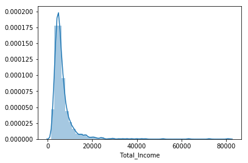
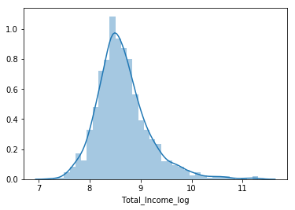
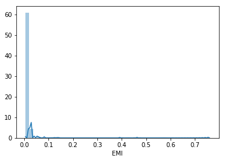
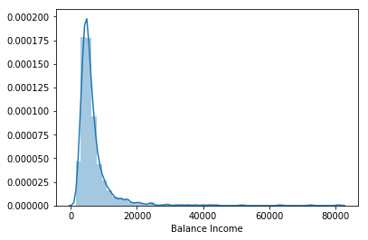
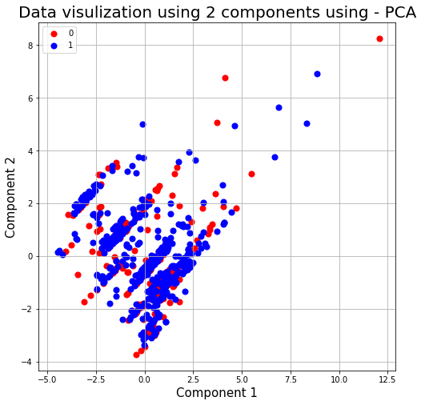
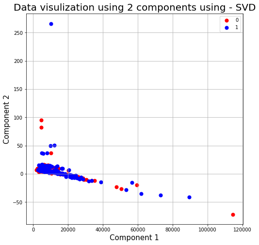

# Importing Libraries


```python
import re
import pandas as pd 
import numpy as np 
import matplotlib.pyplot as plt 
import seaborn as sns
import string
import nltk
import warnings 
from sklearn import datasets, linear_model
from sklearn.metrics import mean_squared_error, r2_score
from sklearn.linear_model import LogisticRegression
warnings.filterwarnings("ignore", category=DeprecationWarning)
from sklearn.model_selection import StratifiedKFold


from sklearn.metrics import accuracy_score
%matplotlib inline
```

# Reading Data from CSV files


```python
test  = pd.read_csv('test_Y3wMUE5_7gLdaTN.csv')
train = pd.read_csv('train_u6lujuX_CVtuZ9i.csv')
test.shape
```


    (367, 12)


# Combining training and testing data for preprocessing


```python
totalData = train.append(test, ignore_index=True)
train.head(10)
```

    C:\Users\ketan\Anaconda3\lib\site-packages\pandas\core\frame.py:6211: FutureWarning: Sorting because non-concatenation axis is not aligned. A future version
    of pandas will change to not sort by default.
    
    To accept the future behavior, pass 'sort=False'.
    
    To retain the current behavior and silence the warning, pass 'sort=True'.
    
      sort=sort)
    


<div>
<style scoped>
    .dataframe tbody tr th:only-of-type {
        vertical-align: middle;
    }

    .dataframe tbody tr th {
        vertical-align: top;
    }

    .dataframe thead th {
        text-align: right;
    }
</style>
<table border="1" class="dataframe">
  <thead>
    <tr style="text-align: right;">
      <th></th>
      <th>Loan_ID</th>
      <th>Gender</th>
      <th>Married</th>
      <th>Dependents</th>
      <th>Education</th>
      <th>Self_Employed</th>
      <th>ApplicantIncome</th>
      <th>CoapplicantIncome</th>
      <th>LoanAmount</th>
      <th>Loan_Amount_Term</th>
      <th>Credit_History</th>
      <th>Property_Area</th>
      <th>Loan_Status</th>
    </tr>
  </thead>
  <tbody>
    <tr>
      <th>0</th>
      <td>LP001002</td>
      <td>Male</td>
      <td>No</td>
      <td>0</td>
      <td>Graduate</td>
      <td>No</td>
      <td>5849</td>
      <td>0.0</td>
      <td>NaN</td>
      <td>360.0</td>
      <td>1.0</td>
      <td>Urban</td>
      <td>Y</td>
    </tr>
    <tr>
      <th>1</th>
      <td>LP001003</td>
      <td>Male</td>
      <td>Yes</td>
      <td>1</td>
      <td>Graduate</td>
      <td>No</td>
      <td>4583</td>
      <td>1508.0</td>
      <td>128.0</td>
      <td>360.0</td>
      <td>1.0</td>
      <td>Rural</td>
      <td>N</td>
    </tr>
    <tr>
      <th>2</th>
      <td>LP001005</td>
      <td>Male</td>
      <td>Yes</td>
      <td>0</td>
      <td>Graduate</td>
      <td>Yes</td>
      <td>3000</td>
      <td>0.0</td>
      <td>66.0</td>
      <td>360.0</td>
      <td>1.0</td>
      <td>Urban</td>
      <td>Y</td>
    </tr>
    <tr>
      <th>3</th>
      <td>LP001006</td>
      <td>Male</td>
      <td>Yes</td>
      <td>0</td>
      <td>Not Graduate</td>
      <td>No</td>
      <td>2583</td>
      <td>2358.0</td>
      <td>120.0</td>
      <td>360.0</td>
      <td>1.0</td>
      <td>Urban</td>
      <td>Y</td>
    </tr>
    <tr>
      <th>4</th>
      <td>LP001008</td>
      <td>Male</td>
      <td>No</td>
      <td>0</td>
      <td>Graduate</td>
      <td>No</td>
      <td>6000</td>
      <td>0.0</td>
      <td>141.0</td>
      <td>360.0</td>
      <td>1.0</td>
      <td>Urban</td>
      <td>Y</td>
    </tr>
    <tr>
      <th>5</th>
      <td>LP001011</td>
      <td>Male</td>
      <td>Yes</td>
      <td>2</td>
      <td>Graduate</td>
      <td>Yes</td>
      <td>5417</td>
      <td>4196.0</td>
      <td>267.0</td>
      <td>360.0</td>
      <td>1.0</td>
      <td>Urban</td>
      <td>Y</td>
    </tr>
    <tr>
      <th>6</th>
      <td>LP001013</td>
      <td>Male</td>
      <td>Yes</td>
      <td>0</td>
      <td>Not Graduate</td>
      <td>No</td>
      <td>2333</td>
      <td>1516.0</td>
      <td>95.0</td>
      <td>360.0</td>
      <td>1.0</td>
      <td>Urban</td>
      <td>Y</td>
    </tr>
    <tr>
      <th>7</th>
      <td>LP001014</td>
      <td>Male</td>
      <td>Yes</td>
      <td>3+</td>
      <td>Graduate</td>
      <td>No</td>
      <td>3036</td>
      <td>2504.0</td>
      <td>158.0</td>
      <td>360.0</td>
      <td>0.0</td>
      <td>Semiurban</td>
      <td>N</td>
    </tr>
    <tr>
      <th>8</th>
      <td>LP001018</td>
      <td>Male</td>
      <td>Yes</td>
      <td>2</td>
      <td>Graduate</td>
      <td>No</td>
      <td>4006</td>
      <td>1526.0</td>
      <td>168.0</td>
      <td>360.0</td>
      <td>1.0</td>
      <td>Urban</td>
      <td>Y</td>
    </tr>
    <tr>
      <th>9</th>
      <td>LP001020</td>
      <td>Male</td>
      <td>Yes</td>
      <td>1</td>
      <td>Graduate</td>
      <td>No</td>
      <td>12841</td>
      <td>10968.0</td>
      <td>349.0</td>
      <td>360.0</td>
      <td>1.0</td>
      <td>Semiurban</td>
      <td>N</td>
    </tr>
  </tbody>
</table>
</div>


# Preprocessing and Reducing the noise 


```python
totalData.isnull().sum()
totalData = totalData.drop(["Loan_ID"], axis=1)
```


```python

totalData['Gender'].fillna(train['Gender'].mode()[0], inplace=True)
totalData['Married'].fillna(train['Married'].mode()[0], inplace=True)
# totalData['Dependents'].fillna(train['Dependents'].mode()[0], inplace=True)
totalData['Self_Employed'].fillna(train['Self_Employed'].mode()[0], inplace=True)
totalData['Credit_History'].fillna(train['Credit_History'].mode()[0], inplace=True)
totalData['Loan_Amount_Term'].fillna(train['Loan_Amount_Term'].mode()[0], inplace=True)
pd.options.mode.chained_assignment = None
totalData['LoanAmount'].fillna(train['LoanAmount'].median(), inplace=True)

totalData.isnull().sum()
```


    ApplicantIncome        0
    CoapplicantIncome      0
    Credit_History         0
    Dependents            25
    Education              0
    Gender                 0
    LoanAmount             0
    Loan_Amount_Term       0
    Loan_Status          367
    Married                0
    Property_Area          0
    Self_Employed          0
    dtype: int64


```python
totalData['LoanAmount'] = np.log(totalData['LoanAmount'])
totalData.isnull().sum()
```


    ApplicantIncome        0
    CoapplicantIncome      0
    Credit_History         0
    Dependents            25
    Education              0
    Gender                 0
    LoanAmount             0
    Loan_Amount_Term       0
    Loan_Status          367
    Married                0
    Property_Area          0
    Self_Employed          0
    dtype: int64


# Handling categorical features


```python
LoanStatus = totalData['Loan_Status']
totalData = totalData.drop(["Loan_Status"], axis=1)

# column_names_for_onehot = ['Property_Area','Self_Employed','Education','Married','Gender','Credit_History']
# totalData = pd.get_dummies(totalData, columns=column_names_for_onehot, drop_first=True)
totalData = pd.get_dummies(totalData)
totalData = pd.concat([totalData, LoanStatus], axis=1)
```

# Feature Engineering


```python
totalData['Total_Income']=totalData['ApplicantIncome']+totalData['CoapplicantIncome']
sns.distplot(totalData['Total_Income']);
```

    C:\Users\ketan\Anaconda3\lib\site-packages\scipy\stats\stats.py:1713: FutureWarning: Using a non-tuple sequence for multidimensional indexing is deprecated; use `arr[tuple(seq)]` instead of `arr[seq]`. In the future this will be interpreted as an array index, `arr[np.array(seq)]`, which will result either in an error or a different result.
      return np.add.reduce(sorted[indexer] * weights, axis=axis) / sumval
    





```python
#Taking log to make data normalized
totalData['Total_Income_log'] = np.log(totalData['Total_Income'])
sns.distplot(totalData['Total_Income_log']);
```

    C:\Users\ketan\Anaconda3\lib\site-packages\scipy\stats\stats.py:1713: FutureWarning: Using a non-tuple sequence for multidimensional indexing is deprecated; use `arr[tuple(seq)]` instead of `arr[seq]`. In the future this will be interpreted as an array index, `arr[np.array(seq)]`, which will result either in an error or a different result.
      return np.add.reduce(sorted[indexer] * weights, axis=axis) / sumval
    





```python
totalData['EMI']=totalData['LoanAmount']/totalData['Loan_Amount_Term']
sns.distplot(totalData['EMI']);
```

    C:\Users\ketan\Anaconda3\lib\site-packages\scipy\stats\stats.py:1713: FutureWarning: Using a non-tuple sequence for multidimensional indexing is deprecated; use `arr[tuple(seq)]` instead of `arr[seq]`. In the future this will be interpreted as an array index, `arr[np.array(seq)]`, which will result either in an error or a different result.
      return np.add.reduce(sorted[indexer] * weights, axis=axis) / sumval
    





```python
totalData['Balance Income']=totalData['Total_Income']-(totalData['EMI']*1000) # Multiply with 1000 to make the units equal 
sns.distplot(totalData['Balance Income']);
```

    C:\Users\ketan\Anaconda3\lib\site-packages\scipy\stats\stats.py:1713: FutureWarning: Using a non-tuple sequence for multidimensional indexing is deprecated; use `arr[tuple(seq)]` instead of `arr[seq]`. In the future this will be interpreted as an array index, `arr[np.array(seq)]`, which will result either in an error or a different result.
      return np.add.reduce(sorted[indexer] * weights, axis=axis) / sumval
    





```python
totalData=totalData.drop(['ApplicantIncome', 'CoapplicantIncome', 'LoanAmount', 'Loan_Amount_Term'], axis=1)
```

# Preparing training and testing data for applying models


```python
# totalData = totalData.drop(["Loan_ID"], axis=1)
totalData.Loan_Status[totalData.Loan_Status == 'Y' ] = 1
totalData.Loan_Status[totalData.Loan_Status == 'N' ] = 0
trainingData = totalData.iloc[:(train.shape[0])]
testingData = totalData.iloc[(train.shape[0]):]

trainingData = trainingData.dropna(axis=0)
y_train = trainingData['Loan_Status']
# x_train = trainingData.iloc[:(train.shape[0])].drop(["Loan_Status_1"], axis=1)
x_train = trainingData.drop(["Loan_Status"], axis=1)
y_train = y_train.astype('int')

x_test = testingData.drop(["Loan_Status"], axis=1)
x_test = x_test.fillna(0)
```

# Data Visulization function for PCA and SVD


```python
def dataVisulizationFunction(components, method, y_total):
    principleDf = pd.concat([pd.DataFrame(data = components, columns=['Comp1', 'Comp2']), y_total], axis=1)

    #Graph ploting
    fig = plt.figure(figsize=(8,8))
    ax = fig.add_subplot(1, 1, 1)
    ax.set_xlabel('Component 1', fontsize=15)
    ax.set_ylabel('Component 2', fontsize=15)
    ax.set_title("Data visulization using 2 components using - {}".format(method), fontsize=20)

    targets = [0, 1]
    colors = ['r', 'b']

    for target, color in zip(targets, colors):
        indicesToKeep = principleDf['Loan_Status'] == target
        ax.scatter(principleDf.loc[indicesToKeep, 'Comp1'], principleDf.loc[indicesToKeep, 'Comp2'], c = color, s = 50)

    ax.legend(targets)
    ax.grid()
```

# PCA implementation


```python
from sklearn.decomposition import PCA
from sklearn.preprocessing import StandardScaler
from sklearn.decomposition import TruncatedSVD

scalar = StandardScaler()
scalar.fit(x_train)
x = scalar.transform(x_train)
pca = PCA(n_components=2)
pcaComponents = pca.fit_transform(x)
dataVisulizationFunction(pcaComponents,"PCA", y_train)
print("Variance content of 2 components :{}".format(pca.explained_variance_ratio_))
```

    Variance content of 2 components :[0.17381482 0.13780712]
    





# SVD implementation


```python
svd = TruncatedSVD(n_components=2)
u = svd.fit_transform(x_train)
s = svd.explained_variance_
vt = svd.components_
dataVisulizationFunction(u, "SVD",y_train)
```





```python
def modelHelperFunction(x_train, y_train, model):
    i=1
    kf = StratifiedKFold(n_splits=5,random_state=1,shuffle=True)
    for train_index,test_index in kf.split(x_train, y_train):
         print('\n{} of kfold {}'.format(i,kf.n_splits))
         xtr,xvl = x_train.loc[train_index],x_train.loc[test_index]
         ytr,yvl = y_train[train_index],y_train[test_index]
         model.fit(xtr, ytr)
         pred_test = model.predict(xvl)
         score = accuracy_score(yvl,pred_test)
         print('accuracy_score',score)
         i+=1
    predictions = model.predict(x_test)
    pred = model.predict_proba(xvl)[:,1]
    return predictions
```


```python
def csvHelper(predictions, model):
    test["Loan_Status"] = pd.DataFrame(predictions, columns =["Loan_Status"])
    test.Loan_Status[test.Loan_Status == 1 ] = 'Y'
    test.Loan_Status[test.Loan_Status == 0 ] = 'N'
    header = ["Loan_ID", "Loan_Status"]
    test.to_csv(model+'Submission.csv', columns = header,index =False)
```

# 1. RandomForestClassifier


```python
# all parameters not specified are set to their defaults
from sklearn.ensemble import RandomForestClassifier
rft = RandomForestClassifier(n_estimators=1000, n_jobs = -1, random_state=42)
predictions = modelHelperFunction(x_train, y_train, rft)
csvHelper(predictions, "RandomForestClassifier")
```

    
    1 of kfold 5
    accuracy_score 0.7661290322580645
    
    2 of kfold 5
    accuracy_score 0.8064516129032258
    
    3 of kfold 5
    accuracy_score 0.7459016393442623
    
    4 of kfold 5
    accuracy_score 0.7704918032786885
    
    5 of kfold 5
    accuracy_score 0.8278688524590164
    

# 2. Neural Network


```python
from sklearn.neural_network import MLPClassifier
nnClassifier = MLPClassifier(solver='adam', learning_rate = 'adaptive',max_iter =500,
                     hidden_layer_sizes=(512,128), random_state=1)

nnClassifier.fit(x_train, y_train)


# Use score method to get accuracy of model
print(("Accuracy of training subset is: {:.3f}").format(nnClassifier.score(x_train, y_train)))

predicted_values = nnClassifier.predict(x_test)
predicted_values
```

    Accuracy of training subset is: 0.313
    


    array([0, 0, 0, 0, 0, 0, 0, 0, 0, 0, 0, 0, 0, 0, 0, 0, 0, 0, 0, 0, 0, 0,
           0, 0, 0, 0, 0, 0, 0, 0, 0, 0, 0, 0, 0, 0, 0, 0, 0, 0, 0, 0, 0, 0,
           0, 0, 0, 0, 0, 0, 0, 0, 0, 0, 0, 0, 0, 0, 0, 0, 0, 0, 0, 0, 0, 0,
           0, 0, 0, 0, 0, 0, 0, 0, 0, 0, 0, 0, 0, 0, 0, 0, 0, 0, 0, 0, 0, 0,
           0, 0, 0, 0, 0, 0, 0, 0, 0, 0, 0, 0, 0, 0, 0, 0, 0, 0, 0, 0, 0, 0,
           0, 0, 0, 0, 0, 0, 0, 0, 0, 0, 0, 0, 0, 0, 0, 0, 0, 0, 0, 0, 0, 0,
           0, 0, 0, 0, 0, 0, 0, 0, 0, 0, 0, 0, 0, 0, 0, 0, 0, 0, 0, 0, 0, 0,
           0, 0, 0, 0, 0, 0, 0, 0, 0, 0, 0, 0, 0, 0, 0, 0, 0, 0, 0, 0, 0, 0,
           0, 0, 0, 0, 0, 0, 0, 0, 0, 0, 0, 0, 0, 0, 0, 0, 0, 0, 0, 0, 0, 0,
           0, 0, 0, 0, 0, 0, 0, 0, 0, 0, 0, 0, 0, 0, 0, 0, 0, 0, 0, 0, 0, 0,
           0, 0, 0, 0, 0, 0, 0, 0, 0, 0, 0, 0, 0, 0, 0, 0, 0, 0, 0, 0, 0, 0,
           0, 0, 0, 0, 0, 0, 0, 0, 0, 0, 0, 0, 0, 0, 0, 0, 0, 0, 0, 0, 0, 0,
           0, 0, 0, 0, 0, 0, 0, 0, 0, 0, 0, 0, 0, 0, 0, 0, 0, 0, 0, 0, 0, 0,
           0, 0, 0, 0, 0, 0, 0, 0, 0, 0, 0, 0, 0, 0, 0, 0, 0, 0, 0, 0, 0, 0,
           0, 0, 0, 0, 0, 0, 0, 0, 0, 0, 0, 0, 0, 0, 0, 0, 0, 0, 0, 0, 0, 0,
           0, 0, 0, 0, 0, 0, 0, 0, 0, 0, 0, 0, 0, 0, 0, 0, 0, 0, 0, 0, 0, 0,
           0, 0, 0, 0, 0, 0, 0, 0, 0, 0, 0, 0, 0, 0, 0])


# 3. Logistic Classifier


```python
lrclf = LogisticRegression()
predictions = modelHelperFunction(x_train, y_train, lrclf)
csvHelper(predictions, "LogisticRegressionClassifier")
```

    
    1 of kfold 5
    accuracy_score 0.7983870967741935
    
    2 of kfold 5
    accuracy_score 0.8306451612903226
    
    3 of kfold 5
    accuracy_score 0.8032786885245902
    
    4 of kfold 5
    accuracy_score 0.7622950819672131
    
    5 of kfold 5
    accuracy_score 0.8278688524590164
    

# 4. Decision tree classifier


```python
from sklearn.tree import DecisionTreeClassifier
newtree = DecisionTreeClassifier(random_state = 0)
predictions = modelHelperFunction(x_train, y_train, newtree)
csvHelper(predictions, "DecisionTreeClassifier")
```

    
    1 of kfold 5
    accuracy_score 0.7419354838709677
    
    2 of kfold 5
    accuracy_score 0.7419354838709677
    
    3 of kfold 5
    accuracy_score 0.6885245901639344
    
    4 of kfold 5
    accuracy_score 0.7049180327868853
    
    5 of kfold 5
    accuracy_score 0.6885245901639344
    

# 5. Adaboost Classifier


```python
from sklearn.ensemble import AdaBoostClassifier
bdt = AdaBoostClassifier(DecisionTreeClassifier(max_depth=1),
                         algorithm="SAMME",
                         n_estimators=250)

predictions = modelHelperFunction(x_train, y_train, bdt)
csvHelper(predictions, "AdaBoostClassifier")
```

    
    1 of kfold 5
    accuracy_score 0.8064516129032258
    
    2 of kfold 5
    accuracy_score 0.8145161290322581
    
    3 of kfold 5
    accuracy_score 0.7950819672131147
    
    4 of kfold 5
    accuracy_score 0.7950819672131147
    
    5 of kfold 5
    accuracy_score 0.8360655737704918
    

# 6. GradientBoostingClassifier


```python
from sklearn.ensemble import GradientBoostingClassifier
gbclf = GradientBoostingClassifier(n_estimators=100, learning_rate=1.0,max_depth=1, random_state=0)
predictions = modelHelperFunction(x_train, y_train, gbclf)
csvHelper(predictions, "GradientBoostingClassifier")
```

    
    1 of kfold 5
    accuracy_score 0.7661290322580645
    
    2 of kfold 5
    accuracy_score 0.8064516129032258
    
    3 of kfold 5
    accuracy_score 0.7459016393442623
    
    4 of kfold 5
    accuracy_score 0.8032786885245902
    
    5 of kfold 5
    accuracy_score 0.8114754098360656
    

# 7. Naive Bayes Classifier


```python
from sklearn.naive_bayes import GaussianNB
nbclf = GaussianNB()
predictions = modelHelperFunction(x_train, y_train, nbclf)
csvHelper(predictions, "NaiveBayesClassifier")
```

    
    1 of kfold 5
    accuracy_score 0.7983870967741935
    
    2 of kfold 5
    accuracy_score 0.8145161290322581
    
    3 of kfold 5
    accuracy_score 0.8114754098360656
    
    4 of kfold 5
    accuracy_score 0.7868852459016393
    
    5 of kfold 5
    accuracy_score 0.8360655737704918
    

# 8. VotingClassifier


```python
from sklearn.ensemble import VotingClassifier
eclf = VotingClassifier(estimators=[('lr', lrclf), ('rf', rft), ('gnb', nbclf),('gbclf',gbclf),('bdt',bdt),('newtree',newtree)], voting='hard')
eclf.fit(x_train, y_train)
prediction = eclf.predict(x_test)
print(("Accuracy of training subset is: {:.3f}").format(eclf.score(x_train, y_train)))
csvHelper(prediction, "VotingClassifier")

```

    Accuracy of training subset is: 0.850
    

# 9. voting classifier with GridSearchCV


```python
from sklearn.model_selection import GridSearchCV
eclf = VotingClassifier(estimators=[('lr', lrclf), ('rf', rft), ('gnb', nbclf),('gbclf',gbclf),('bdt',bdt),('newtree',newtree)], voting='hard')
params = {'lr__C': [1.0, 100.0], 'rf__n_estimators': [20, 200]}
grid = GridSearchCV(estimator=eclf, param_grid=params, cv=5)
grid = grid.fit(x_train, y_train)
print(("Accuracy of training subset is: {:.3f}").format(grid.score(x_train, y_train)))
prediction = grid.predict(x_test)
csvHelper(prediction, "GridVotingClassifier")
```

    Accuracy of training subset is: 0.850
    

# 10.XGBoost


```python
from xgboost import XGBClassifier
xgb = XGBClassifier(n_estimators=50, max_depth=4)
prediction = modelHelperFunction(x_train, y_train, xgb)
csvHelper(prediction, "XGBClassifier")
```

    
    1 of kfold 5
    accuracy_score 0.7741935483870968
    
    2 of kfold 5
    accuracy_score 0.8225806451612904
    
    3 of kfold 5
    accuracy_score 0.7459016393442623
    
    4 of kfold 5
    accuracy_score 0.7786885245901639
    
    5 of kfold 5
    accuracy_score 0.8278688524590164
    
